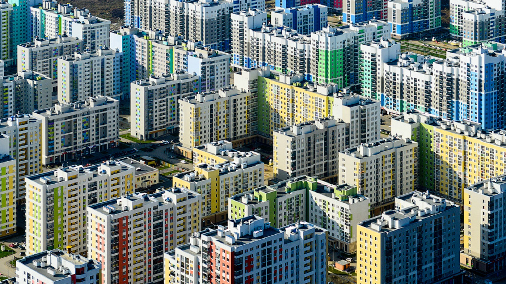
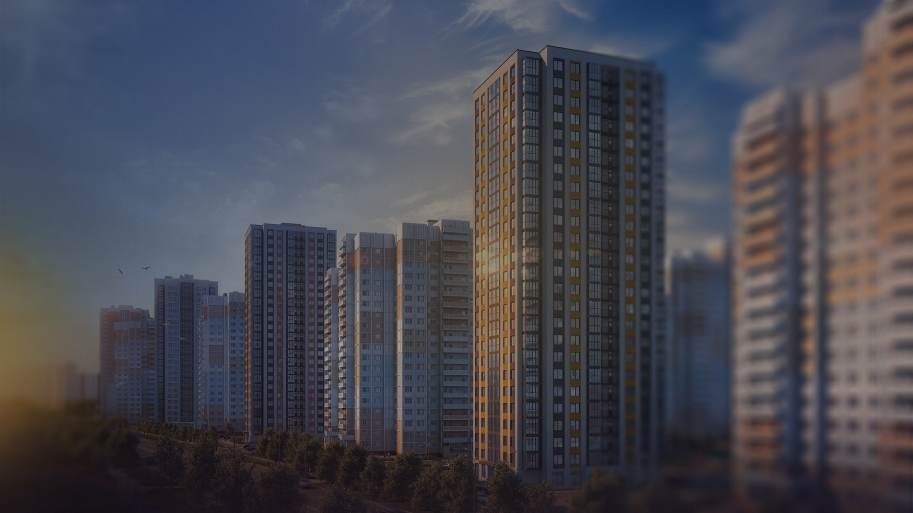

# Hero — секция главной страницы (React-референс)

Точная структура/копирайт/токены. Переносить как отдельный Vue-компонент `Hero.vue`, не копировать JSX напрямую.

```jsx
function Hero() {
  const { Button, Logo } = window.DesignSystem_16ec3d;
  const navLinks = ["Услуги", "Недвижимость", "Спецпредложения", "Цены", "Отзывы", "Контакты"];
  return (
    <div style={{ position: "relative", width: 1920, height: 1050, background: "var(--neutral-900)", overflow: "hidden" }}>
      
      
      <div style={{ position: "absolute", left: 0, top: 0, width: 1920, height: 1050, background: "radial-gradient(1200px 700px at 78% 8%, rgba(40,49,56,0.75) 0%, rgba(40,49,56,0) 60%)" }} />
      <div style={{ position: "absolute", left: 0, top: 640, width: 1920, height: 410, background: "linear-gradient(180deg, rgba(47,51,54,0) 0%, var(--neutral-900) 88%)" }} />
      <div style={{ position: "absolute", left: 0, top: 0, width: 1920, height: 45, background: "var(--neutral-950)" }} />

      {/* decorative angular flourishes — exact paths from source */}
      <svg width="75" height="96" viewBox="0 0 75 96" fill="var(--blue-500)" style={{ position: "absolute", left: -52, top: 777 }}>
        <path d="M 75 44.177 C 51.685 29.735 4.045 0.68 0 0 L 0 51.823 L 75 96 L 75 44.177 Z" />
      </svg>
      <svg width="87.587" height="112.151" viewBox="0 0 87.587 112.151" fill="var(--blue-500)" style={{ position: "absolute", left: 1851, top: 438 }}>
        <path d="M 87.587 51.609 C 60.359 34.737 4.724 0.794 0 0 L 0 60.542 L 87.587 112.151 L 87.587 51.609 Z" />
      </svg>

      {/* top utility bar */}
      <nav style={{ position: "absolute", left: 390, top: 15, display: "flex", gap: 26 }}>
        {navLinks.map((l) => (
          <a key={l} href="#" style={{ fontFamily: "var(--font-sans)", fontSize: 12, fontWeight: 600, letterSpacing: "0.05em", color: "var(--ink-100-on-dark)" }}>{l}</a>
        ))}
      </nav>
      <div style={{ position: "absolute", left: 1326, top: 18, width: 9, height: 9, borderRadius: "50%", background: "var(--success-500)" }} />
      <span style={{ position: "absolute", left: 1344, top: 15, fontFamily: "var(--font-sans)", fontSize: 12, color: "var(--surface-white)" }}>Сейчас открыты</span>

      {/* logo + contacts row */}
      <Logo variant="full" height={54} style={{ position: "absolute", left: 390, top: 86 }} />
      <span style={{ position: "absolute", left: 746, top: 126, width: 239, fontFamily: "var(--font-sans)", fontSize: 14, lineHeight: 1.3, color: "var(--surface-white)" }}>г. Астана, БЦ "Астана", 4 этаж (Астанинская, 3/1; Северная 15/1)</span>
      <div style={{ position: "absolute", left: 1052, top: 121 }}>
        <div style={{ fontFamily: "var(--font-sans)", fontWeight: 800, fontSize: 22, letterSpacing: "0.05em", color: "var(--surface-white)" }}>+7 (999) 777-33-50</div>
        <div style={{ fontFamily: "var(--font-sans)", fontSize: 14, color: "var(--ink-100-on-dark)", marginTop: 6 }}>Viber, What's App</div>
      </div>
      <div style={{ position: "absolute", left: 1327, top: 121 }}>
        <div style={{ fontFamily: "var(--font-sans)", fontWeight: 800, fontSize: 22, letterSpacing: "0.05em", color: "var(--surface-white)" }}>+7 (3444) 94-44-44</div>
        <div style={{ fontFamily: "var(--font-sans)", fontWeight: 600, fontSize: 14, color: "var(--blue-500)", textDecoration: "underline", marginTop: 6, cursor: "pointer" }}>Заказать звонок</div>
      </div>

      {/* headline */}
      <p style={{ position: "absolute", left: 390, top: 287, fontFamily: "var(--font-sans)", fontSize: 14, letterSpacing: "0.25em", color: "var(--surface-white)", opacity: 0.8, margin: 0 }}>АГЕНТСТВО НЕДВИЖИМОСТИ</p>
      <h1 style={{ position: "absolute", left: 386, top: 314, width: 620, fontFamily: "var(--font-sans)", fontWeight: 700, fontSize: 62, lineHeight: 0.8, letterSpacing: "0.03em", color: "var(--surface-white)", textShadow: "var(--shadow-text-hero)", margin: 0 }}>Ваш личный агент<br />по недвижимости</h1>
      <p style={{ position: "absolute", left: 389, top: 482, width: 574, fontFamily: "var(--font-sans)", fontWeight: 600, fontSize: 22, lineHeight: 1.2, color: "var(--surface-white)", margin: 0 }}>Отстаивание Ваших интересов и надежная поддержка в любой ситуации для решения самых трудных квартирных вопросов в Оренбурге</p>

      <Button variant="primary" style={{ position: "absolute", left: 390, top: 615 }}>Заказать консультацию</Button>
      <div style={{ position: "absolute", left: 736, top: 630, width: 80, height: 80, borderRadius: "50%", background: "rgba(27,27,27,0.3)", display: "flex", alignItems: "center", justifyContent: "center", cursor: "pointer" }}>
        <div style={{ width: 50, height: 50, borderRadius: "50%", background: "var(--neutral-900)", display: "flex", alignItems: "center", justifyContent: "center" }}>
          <svg width="14" height="14" viewBox="0 0 16 16" fill="var(--surface-white)"><path d="M3 1.5 L14 8 L3 14.5 Z" /></svg>
        </div>
      </div>
      <span style={{ position: "absolute", left: 826, top: 665, fontFamily: "var(--font-sans)", fontWeight: 600, fontSize: 12, letterSpacing: "0.1em", color: "var(--ink-100-on-dark)" }}>Видео</span>

      {/* stat rings */}
      <p style={{ position: "absolute", left: 1113, top: 432, width: 260, margin: 0, textAlign: "center", fontFamily: "var(--font-sans)", fontSize: 11, letterSpacing: "0.1em", textTransform: "uppercase", color: "var(--ink-100-on-dark)" }}>получения ипотеки под</p>
      <div style={{ position: "absolute", left: 1136, top: 474, width: 214, height: 214, borderRadius: "50%", boxShadow: "inset 0 0.5px 0 var(--blue-500), var(--shadow-glow-blue)", display: "flex", alignItems: "center", justifyContent: "center" }}>
        <div style={{ position: "absolute", left: 97, top: -3, width: 21, height: 21, borderRadius: "50%", background: "var(--blue-500)", boxShadow: "var(--shadow-glow-blue)" }} />
        <span style={{ fontFamily: "var(--font-sans)", fontWeight: 700, fontSize: 48, color: "var(--surface-white)" }}>8,4<span style={{ fontSize: 26, fontWeight: 400 }}>%</span></span>
      </div>

      <p style={{ position: "absolute", left: 1231, top: 308, width: 160, margin: 0, textAlign: "center", fontFamily: "var(--font-sans)", fontSize: 11, letterSpacing: "0.05em", color: "var(--ink-100-on-dark)" }}>квартиры от застройщика от, руб.</p>
      <div style={{ position: "absolute", left: 1260, top: 344, width: 102, height: 102, borderRadius: "50%", boxShadow: "inset 0 0.5px 0 var(--blue-500), var(--shadow-glow-blue)", display: "flex", alignItems: "center", justifyContent: "center" }}>
        <div style={{ position: "absolute", left: 44, top: -2, width: 10, height: 10, borderRadius: "50%", background: "var(--blue-500)", boxShadow: "var(--shadow-glow-blue)" }} />
        <span style={{ fontFamily: "var(--font-sans)", fontWeight: 700, fontSize: 21, color: "var(--surface-white)" }}>650<span style={{ fontSize: 12, fontWeight: 400 }}> тыс.</span></span>
      </div>

      <div style={{ position: "absolute", left: 933, top: 772, display: "flex", flexDirection: "column", alignItems: "center", gap: 12 }}>
        <div style={{ width: 19, height: 30, borderRadius: 10, boxShadow: "inset 0 0 0 1.5px var(--ink-400)", display: "flex", justifyContent: "center", paddingTop: 6 }}>
          <div style={{ width: 3, height: 6, borderRadius: 2, background: "var(--ink-400)" }} />
        </div>
        <span style={{ fontFamily: "var(--font-sans)", fontSize: 11, letterSpacing: "0.03em", color: "var(--ink-400)", textTransform: "uppercase" }}>Дальше</span>
      </div>
    </div>
  );
}
window.Hero = Hero;

```
