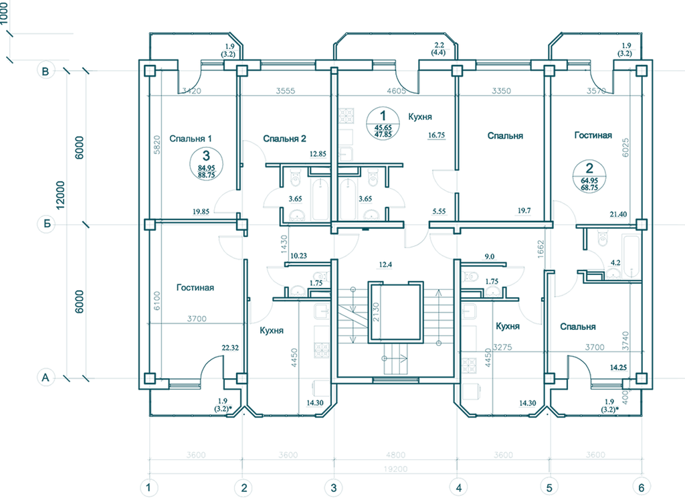
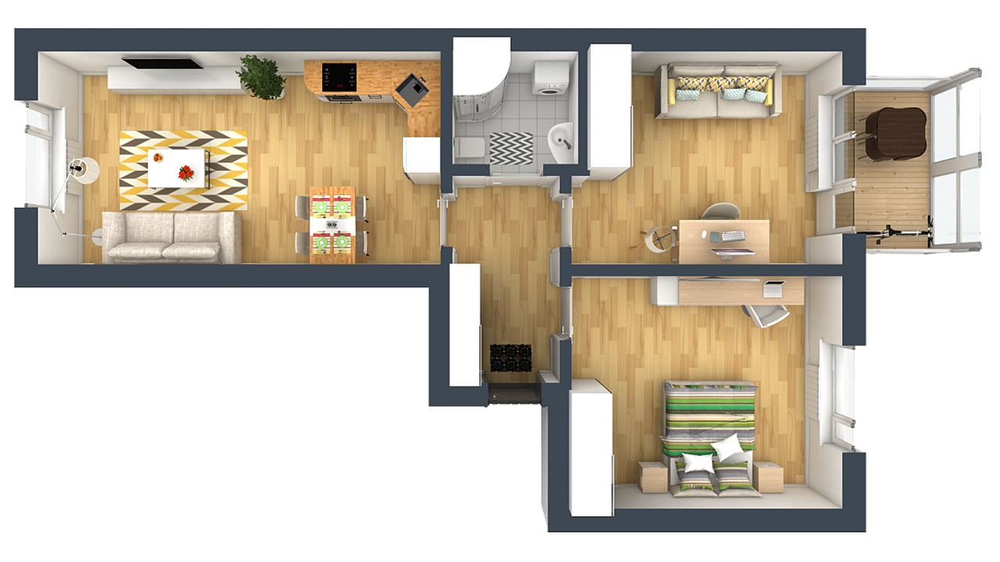

# SearchPanel — секция главной страницы (React-референс)

Точная структура/копирайт/токены. Переносить как отдельный Vue-компонент `SearchPanel.vue`, не копировать JSX напрямую.

```jsx
function SearchPanel() {
  const { Button } = window.DesignSystem_16ec3d;
  const fields = ["Купить", "Квартиру", "Вторичка", "Комнат", "Район"];
  return (
    <div style={{ position: "relative", width: 1920, height: 360, background: "var(--neutral-900)", overflow: "hidden" }}>
      
      <div style={{ position: "absolute", left: 0, top: 0, width: 1920, height: 360, background: "linear-gradient(100deg, var(--neutral-900) 42%, rgba(47,51,54,0.55) 100%)" }} />
      

      <p style={{ position: "absolute", left: 390, top: 44, margin: 0, fontFamily: "var(--font-sans)", fontSize: 14, letterSpacing: "0.2em", color: "var(--blue-500)", textTransform: "uppercase" }}>Подбор</p>
      <h2 style={{ position: "absolute", left: 390, top: 74, margin: 0, width: 460, fontFamily: "var(--font-sans)", fontWeight: 700, fontSize: 36, letterSpacing: "0.05em", lineHeight: 0.9, color: "var(--surface-white)" }}>Найдем объект<br />по вашим пожеланиям</h2>

      <div style={{ position: "absolute", left: 390, top: 240, width: 1040, height: 60, borderRadius: 100, background: "var(--surface-white)", boxShadow: "inset 0 0 0 1px var(--ink-200)", display: "flex", alignItems: "center", padding: "0 28px", gap: 22 }}>
        {fields.map((f, i) => (
          <React.Fragment key={f}>
            <span style={{ fontFamily: "var(--font-sans)", fontWeight: 600, fontSize: 12, letterSpacing: "0.03em", color: "var(--ink-600)", whiteSpace: "nowrap" }}>{f}</span>
            {i < fields.length - 1 && <span style={{ width: 8, height: 8, borderBottom: "1.5px solid var(--ink-400)", borderRight: "1.5px solid var(--ink-400)", transform: "rotate(45deg)", flexShrink: 0 }} />}
          </React.Fragment>
        ))}
      </div>
      <Button variant="primary" style={{ position: "absolute", left: 1460, top: 240, width: 60, height: 60, borderRadius: "50%", padding: 0 }}>
        <svg width="18" height="18" viewBox="0 0 18 18" fill="none"><circle cx="8" cy="8" r="6.5" stroke="#fff" strokeWidth="1.5" /><path d="M13 13L17 17" stroke="#fff" strokeWidth="1.5" strokeLinecap="round" /></svg>
      </Button>
    </div>
  );
}
window.SearchPanel = SearchPanel;

```
