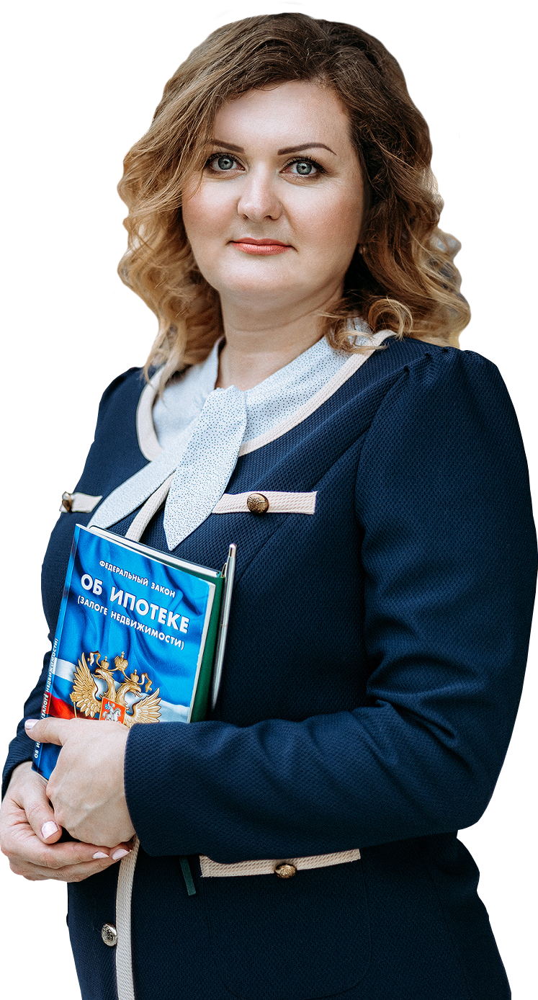

# TeamBio — секция главной страницы (React-референс)

Точная структура/копирайт/токены. Переносить как отдельный Vue-компонент `TeamBio.vue`, не копировать JSX напрямую.

```jsx
function TeamBio() {
  const { Button } = window.DesignSystem_16ec3d;
  return (
    <div style={{ position: "relative", width: 1920, height: 560, background: "var(--surface-white)" }}>
      
      <p style={{ position: "absolute", left: 850, top: 96, margin: 0, fontFamily: "var(--font-sans)", fontSize: 14, letterSpacing: "0.2em", color: "var(--blue-500)", textTransform: "uppercase" }}>Профессиональная команда</p>
      <h2 style={{ position: "absolute", left: 850, top: 126, margin: 0, width: 520, fontFamily: "var(--font-sans)", fontWeight: 700, fontSize: 36, letterSpacing: "0.05em", lineHeight: 0.95, color: "var(--ink-900)" }}>Хороший риэлтор -<br />ваш надежный союзник</h2>
      <p style={{ position: "absolute", left: 850, top: 230, margin: 0, width: 500, fontFamily: "var(--font-sans)", fontSize: 14, lineHeight: 1.5, color: "var(--ink-600)" }}>Наша команда — практикующие риелторы с многолетним опытом сопровождения сделок купли-продажи, аренды и оценки недвижимости в Оренбурге.</p>
      <Button variant="primary" style={{ position: "absolute", left: 850, top: 340 }}>Подробнее об агентстве</Button>
    </div>
  );
}
window.TeamBio = TeamBio;

```
